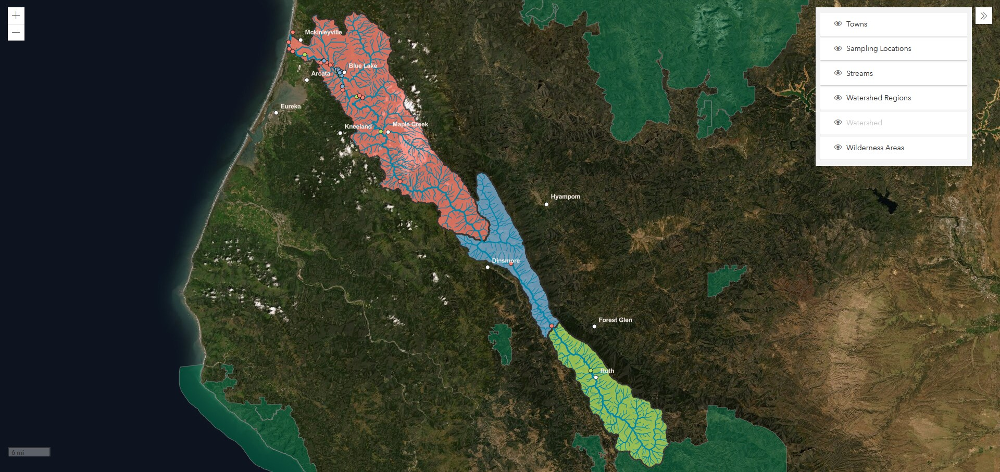

# Mad River Alliance Interactive Map

 

## Description
This map shows features along the Mad River Watershed including Mad River and tributaries, sampling locations, sub-basins, Watershed Regions, Wilderness Areas, and nearby towns. The sampling sites contain a collection of instruments owned and operated by a number of entities with interest in the watershed. These locations collect atmospheric and hrydologic data such as temperature, dissolved oxygen, turbidity, nutrients, flow/stage, mercury, pH, and coliform. Map features are clickable and will display information such as feature name, data collected, etc. [Visit Mad River Alliance](https://madriveralliance.org/) to find out more about what they do. 

## About the Application
This interactive map was built on the [ArcGIS API for JavaScript](https://developers.arcgis.com/javascript/) (current version 4.17) using a webmap built on ArcGIS Online. It uses zoom, and layer control with the ability to toggle layers on/off. It can be viewed on GitHub pages [here](https://yooperjb.github.io/Mad_River_Alliance/), and will be live on the Mad River Alliance website soon.

## Status
The application was recently converted from the old JavaScript API 3.1 version, to 4.17. New data/layers will be added as they become available.